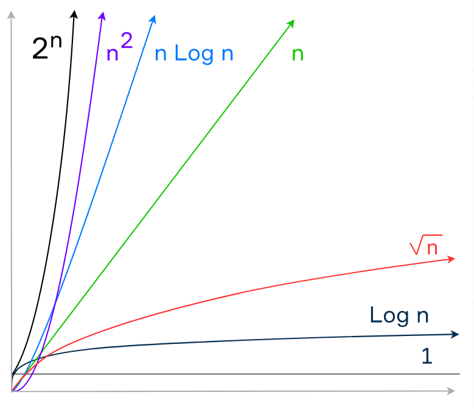

Big O Notation Simplification (Time Complexity)
======================================

Introduction to Big O Notation
------------------------------

Big O notation is used to describe the performance or complexity of an algorithm. It helps in analyzing how the runtime of an algorithm grows as the size of the input data increases.

Understanding Big O
-------------------

Big O notation focuses on the worst-case scenario and provides a general view of algorithm efficiency.

*   Constants don't matter in Big O notation. For example, O(2n) simplifies to O(n), and O(500) simplifies to O(1).
*   Smaller terms and constants are ignored. For instance, O(n + 10) simplifies to O(n).
*   In nested loops, the complexity becomes O(n^2) when there's an O(n) operation inside another O(n) operation.

Big O Notation Graph
---------------------------------

Rules of Thumb for Simplification
---------------------------------

*   Arithmetic operations are constant time.
*   Variable assignment is constant time.
*   Accessing elements in an array or object using an index/key is constant time.
*   In a loop, the complexity is the length of the loop times the complexity of operations inside the loop.

Examples and Code Demonstrations
--------------------------------

### Example 1: Count Up and Down

This function counts up from 0 to n and then counts down from n to 0.

    
    function countUpAndDown(n) {
        for (let i = 0; i < n; i++) {
            console.log(i);
        }
        for (let j = n - 1; j >= 0; j--) {
            console.log(j);
        }
    }
        

The big O notation for this function is O(n), as both loops have a linear relationship with the input size.

### Example 2: Print All Pairs

This function prints all pairs of numbers from 0 to n.

    
    function printAllPairs(n) {
        for (let i = 0; i < n; i++) {
            for (let j = 0; j < n; j++) {
                console.log(i, j);
            }
        }
    }
        

The big O notation for this function is O(n^2), as it involves nested loops where each loop iterates up to n times.

### Example 3: Log At Least Five

This function logs numbers up to n, but at least the first five numbers.

    
    function logAtLeastFive(n) {
        for (let i = 1; i <= Math.max(5, n); i++) {
            console.log(i);
        }
    }
        

The big O notation for this function is O(n), as the loop iterates up to n times or five times, whichever is greater.

### Example 4: Log At Most Five

This function logs numbers up to n, but at most the first five numbers.

    
    function logAtMostFive(n) {
        for (let i = 1; i <= Math.min(5, n); i++) {
            console.log(i);
        }
    }
        

The big O notation for this function is O(1), as the loop iterates at most five times regardless of the input size.

Conclusion
----------

Understanding Big O notation is crucial for analyzing algorithm efficiency. It helps in comparing different algorithms and making informed decisions regarding algorithm selection.