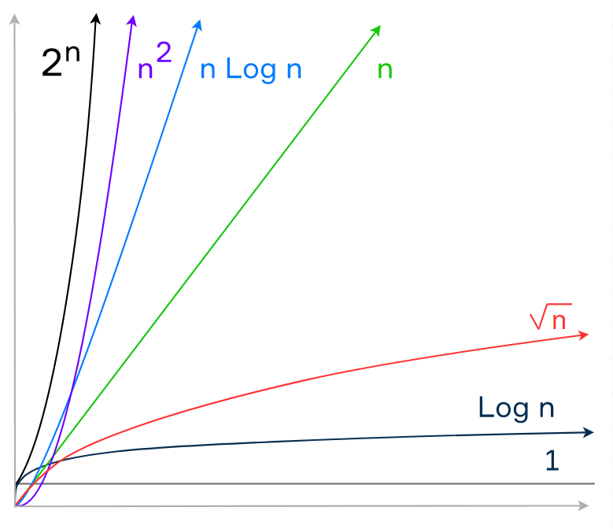

Space Complexity in Algorithms
=======================================

Introduction to Space Complexity
--------------------------------

Space complexity refers to the amount of memory an algorithm uses as the size of the input data increases. Unlike time complexity, which focuses on runtime, space complexity focuses on memory usage.

Understanding Space Complexity
------------------------------

*   Space complexity is often denoted using Big O notation, similar to time complexity.
*   Auxiliary space complexity refers to the space required by the algorithm itself, excluding the space taken up by the input data.

Basic Rules for Space Complexity
--------------------------------

*   Primitives like booleans, numbers, null, and undefined are considered constant space.
*   Strings, arrays, and objects require space proportional to their length or size.

Big O Notation Graph
---------------------------------

Example: Calculating Space Complexity
-------------------------------------

Let's analyze the space complexity of two functions: `sum` and `double`.

### Function: sum

This function calculates the sum of all items in an array.

    
    function sum(arr) {
        let total = 0;
        for (let i = 0; i < arr.length; i++) {
            total += arr[i];
        }
        return total;
    }
        

The space complexity of this function is O(1) as it only uses a constant amount of space, regardless of the input size.

### Function: double

This function doubles each item in an array and returns a new array.

    
    function double(arr) {
        const newArr = [];
        for (let i = 0; i < arr.length; i++) {
            newArr.push(arr[i] * 2);
        }
        return newArr;
    }
        

The space complexity of this function is O(n), where n is the length of the input array. It creates a new array whose size grows linearly with the input size.

Conclusion
----------

Understanding space complexity is essential for optimizing memory usage in algorithms. By analyzing how an algorithm utilizes memory, developers can make informed decisions about efficiency and resource consumption.